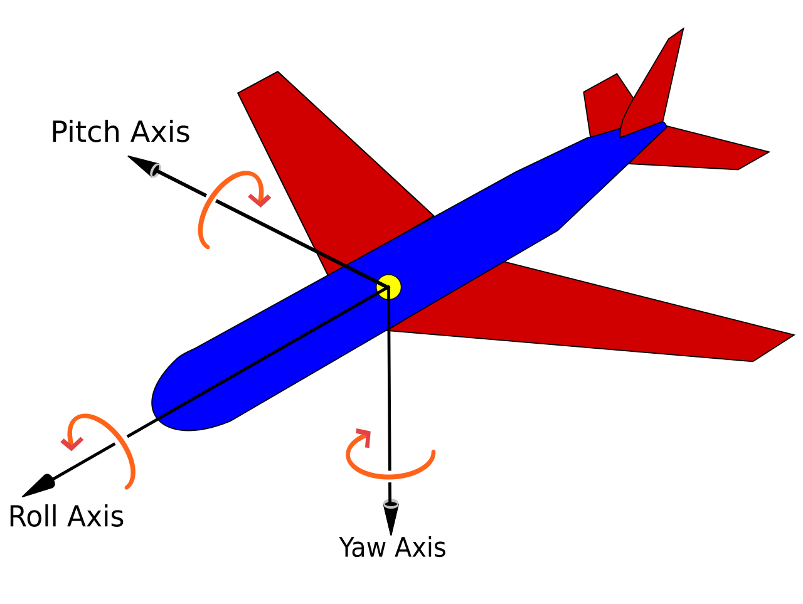

# MPU6050 3D Aircraft Simulation

[](https://youtu.be/YOUR_VIDEO_ID)

📺 **Watch the Full Build Video on YouTube**
https://youtu.be/YOUR_VIDEO_ID

---

## Project Overview

This project demonstrates a real-time **3D Aircraft Orientation Visualization System** using an **MPU6050 sensor** and **Processing**.

The system reads motion data (Yaw, Pitch, Roll) from the MPU6050 sensor and visualizes it as a **3D aircraft model** on a computer screen.

A realistic sky background and smooth motion filtering create a professional simulation experience similar to real aircraft attitude indicators.

This project is ideal for learning **IMU sensors, 3D visualization, motion tracking, and real-time data processing**.

The full build process is available on the **AmithLabs YouTube channel**.

---

## Main Features

* Real-Time Yaw, Pitch, Roll Visualization
* 3D Aircraft Model Rendering (A380)
* Smooth Motion Filtering Algorithm
* Serial Communication with Microcontroller
* Sky Background for Realistic View
* Live Angle Display (Pitch / Roll / Yaw)
* Beginner-Friendly + Professional Output

---

## Hardware Components

* MPU6050 Gyroscope + Accelerometer Sensor
* ESP8266 / ESP32 / Arduino (Any Supported Board)
* USB Cable
* Computer (Processing Software Installed)

---

## Pin Configuration (Example - ESP8266)

| MPU6050 Pin | ESP8266 Pin |
| ---------- | ----------- |
| VCC        | 3.3V        |
| GND        | GND         |
| SDA        | D2 (GPIO4)  |
| SCL        | D1 (GPIO5)  |

---

## System Operation

1. MPU6050 sensor measures orientation (Yaw, Pitch, Roll).
2. Microcontroller reads sensor data and sends it via Serial.
3. Processing application receives real-time data.
4. 3D aircraft model updates based on sensor values.
5. Smooth filtering ensures stable motion.
6. Angle values are displayed live on the screen.

---

## Processing Code

The main Processing sketch is included in this repository:



⚠️ Note: Sensor orientation depends on how the MPU6050 is mounted.

```text
Plane_Sim_3D.pde

## Aircraft Orientation & Tuning


If your aircraft is moving in the wrong direction, you only need to edit **ONE line** in the code:

```java
applyMatrix(getRotationMatrix(yaw, pitch+45, roll));


